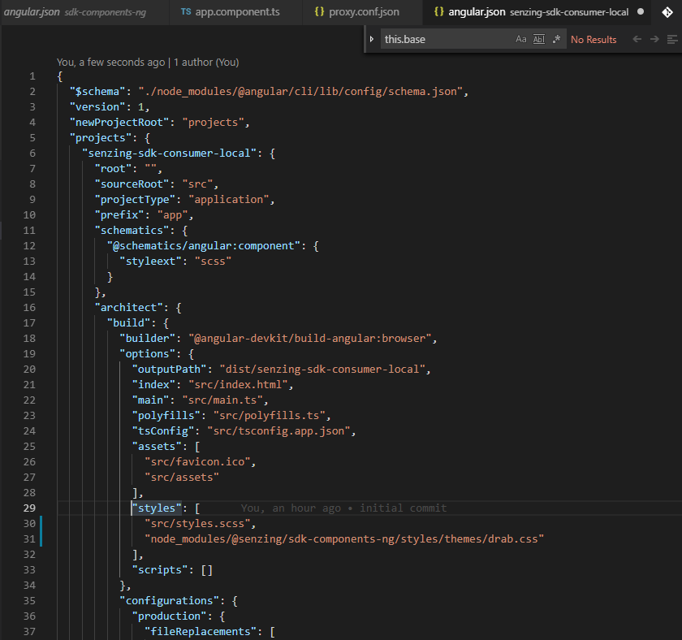

# Pre Defined

We've included some pre-built themes for quick usage to get you up and running. You'll almost certainly want to create your own, or tweak things to match your application's styling as needed. The compiled css files are located in the styles/themes directory in the package being used.

## using sass
if you're using sass(and scss processor can reference node_modules), open up your main scss file(src/styles.scss in default angular layout) and include the following.

```scss
@import '@senzing/sdk-components-ng/styles/themes/senzing.css';
```

## using css
there are several different ways to include a pre-built theme in your project.
You could just add the stylesheet path to your main html file and include the css reference in the HEAD of your document.

```html
<link rel="stylesheet" href="node_modules/@senzing/sdk-components-ng/styles/themes/senzing.css">
```
for production it is recommended you copy the theme stylesheet you will be using over to a static directory(probably a bad idea to leave node_modules open to the world) and change the above reference to point to it's location. 

### angular projects
<center><center>
if you're using the sdk components in the scope of an angular project the recommended way is to add the theme file path to your *angular.json* file for your project.

find the _architect.build.options.styles node in the file, and add the path there. 
```json
"styles": [
  "src/styles.scss",
  "node_modules/\\@senzing/sdk-components-ng/styles/themes/drab.css"
],
```
and next time you run or build your angular project it will include the theme file for the sdk components.

<div style="border-radius: 5px; border: 1px solid #000; padding: 8px;">
  <div><b>Note*</b></div>
  Windows users have to deal with _escaping_ escape charaters when directly accessing npm namespaced paths.
  (illustrated above) 
</div>


## Themes

<div style="display: flex-box; flex-direction: columns;">
  
  <p>
    <h3>Drab</h3>
    <label>location: </label>`node_modules/@senzing/sdk-components-ng/styles/themes/drab.css`
  </p>
</div>
